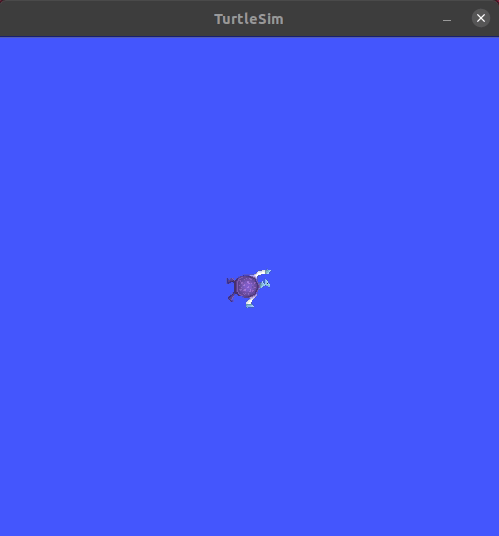
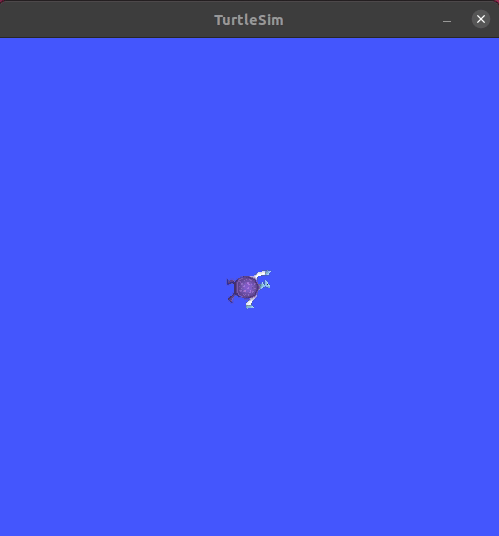
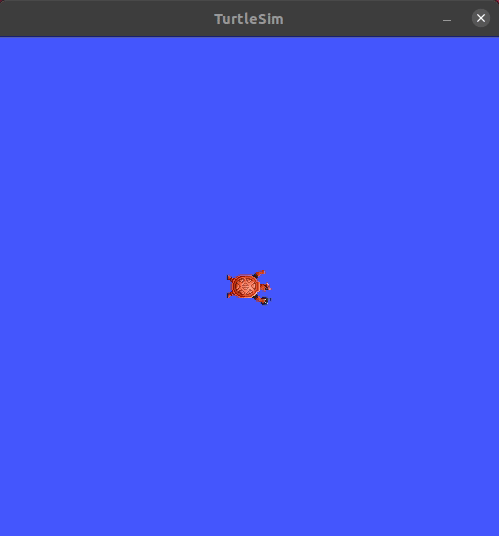
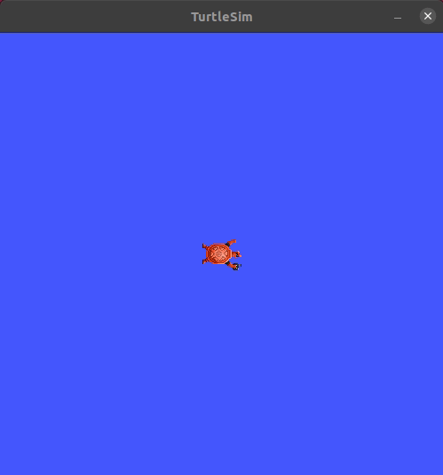
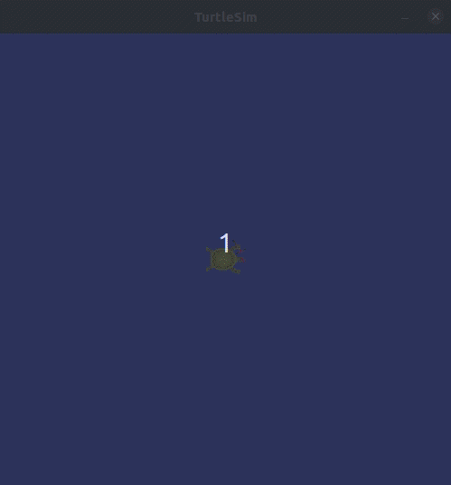
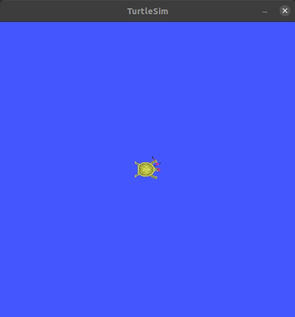
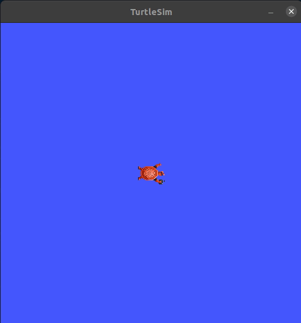

# Turtlesim “Catch Them All” (ROS 2)

## Package Description  

This repository contains a solution for the assignment from the course  
[ROS2 For Beginners](https://www.udemy.com/course/ros2-for-beginners/) | **Section 10**

**Assignment Title:** *Turtlesim “Catch Them All”*

---

## Objective  

The goal of this project is to simulate a simple autonomous chasing system using ROS 2 and Turtlesim:

- Multiple turtles are **spawned** at random positions  
- A **control turtle** continuously identifies and moves toward the **nearest turtle**  
- Once the control turtle reaches the target, the caught turtle is **removed** from the simulation  

---

## Requirements  

Make sure the following dependencies are installed:

- ROS 2 **Humble**
- `turtlesim` package  

Install `turtlesim` using:

```bash
sudo apt-get install ros-humble-turtlesim
```

## Solution Outline  

- The solution is implemented in **C++** using ROS 2  
- A custom **ROS 2 C++ package** is created  
- The system consists of **two nodes**:

### 🔹 Node 1: Turtle Spawner  
- Spawns multiple turtles at **random positions** within the simulator  
- Maintains and publishes the list of active (alive) turtles  

### 🔹 Node 2: Turtle Controller  
- Subscribes to the list of alive turtles  
- Identifies the **nearest turtle** to the control turtle  
- Publishes appropriate **velocity commands** to move toward the target  
- Once the control turtle reaches the target, it triggers a service to **remove (kill)** the turtle  

## Project Status  

<table>
  <tr>
    <td align="center">
      <b>Turtle spawned at a desired position</b><br>
      
    </td>
    <td align="center">
      <b>Multiple turtles spawning</b><br>
      
    </td>
  </tr>
  <tr>
    <td align="center">
      <b>Random turtle spawning</b><br>
      
    </td>
    <td align="center">
      <b>Control turtle navigating to a random pose</b><br>
      
    </td>
  </tr>
  <tr>
    <td align="center">
      <b>Control turtle chasing a target turtle</b><br>
      
    </td>
    <td align="center">
      <b>Caught turtle successfully removed</b><br>
      
    </td>
  </tr>
  <tr>
    <td align="center" colspan="2">
      <b>Nearest turtle targeting behavior</b><br>
      
    </td>
  </tr>
</table>